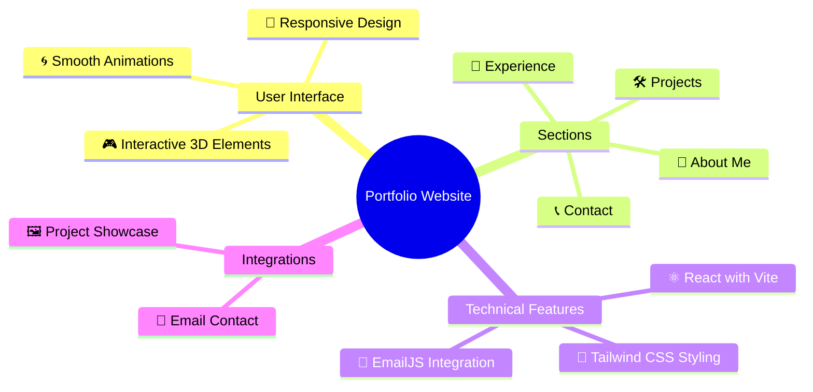

<p align="center">     </p><h1 align="center">✨ My Portfolio Website ✨</h1><p align="center"> A modern, responsive portfolio showcasing my professional journey, projects, and skills. Built with cutting-edge technologies like React, Vite, and Tailwind CSS, featuring smooth animations and interactive 3D elements. 🚀 </p>

</div>

## 🌟 Features
<div align="center">



</div>

## 🚀 Demo

Experience the live portfolio at [https://ayan-bhaumik.github.io/My_Portfolio/](https://ayan-bhaumik.github.io/My_Portfolio/)

## 🛠️ Installation

1️⃣ Clone the repository:

```bash
git clone https://ayan-bhaumik.github.io/Ayans_Portfolio/
```

2️⃣ Navigate to project directory:

```bash
cd Portfolio-Website
```

3️⃣ Install dependencies:

```bash
npm install
```

4️⃣ Run development server:

```bash
npm run dev
```

5️⃣ Open in browser:

- Visit [http://localhost:3000](http://localhost:3000)

## 💻 Tech Stack

<table align="center"> <tr> <td align="center" width="96">  <br>React </td> <td align="center" width="96">  <br>Vite </td> <td align="center" width="96">  <br>Tailwind CSS </td> <td align="center" width="96">  <br>Three.js </td> </tr> </table>

## ⚡ Core Features

- 📱 Responsive Design

  - Mobile-first approach
  - Seamless experience across all devices
  - Adaptive layouts and components

- 🎯 Dynamic Content

  - Interactive project showcase
  - Engaging experience section
  - Animated skill representations

- 🎨 Modern UI/UX

  - Smooth Framer Motion animations
  - Intuitive navigation
  - Clean and professional design
  - Interactive 3D elements using Three.js

- ✉️ Email Integration
  - Contact form using EmailJS

- 📜 License
- This project is licensed under the MIT License - see the LICENSE file for details.

- 🙏 Acknowledgments
- Special thanks to the creators of React, Vite, Tailwind CSS, and Three.js for their amazing tools.

- Inspired by modern design trends and user experience best practices.

<p align="center"> Made with ❤️ by Ayan Bhaumik </p>